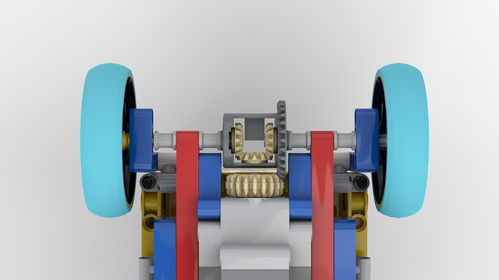
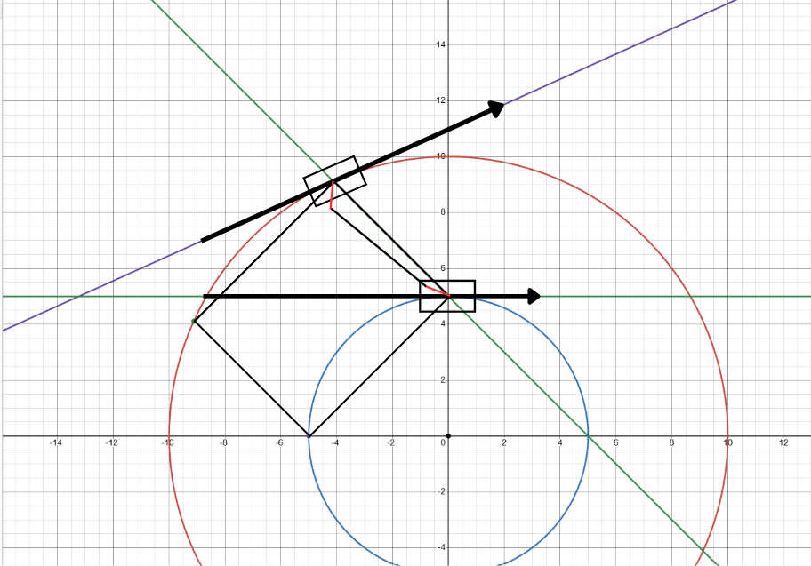

<h3>Our main goal for the development of our chassis</h3>

Low center of gravity
Lightweight
Minimum Size 

<h3>Chassis material choice: LEGO and PLA</h3>

We start the development of our robot using LEGO because we have extensive experience with building and assembling LEGO models. Lam participated in WRO 2023 and WRO 2024 in the Junior Category, so he is very familiar with building robots with LEGO as the main material.

We 3D print several parts which does not exist in the current LEGO collection; they can accommodate LEGO just as good as authentic LEGO pieces, and the freedom of customisation helps us with reaching our main design principles with the chassis. 

<h3>Processing Unit: LEGO® Education SPIKE™ Prime</h3>
    
We choose LEGO processing units, Spike Prime or Mindstorm EV3, over Arduino or Raspberry Pi because our experience shows that we can execute complicated algorithms at an acceptable level.

Between EV3 and Spike Prime, we chose Spike Prime even though the central processing unit of the Spike Prime has a lower clock speed, as the Spike Hub's performance is still adequate for our algorithms. The Spike Prime Hub, including battery, is around 200 grams, almost half as light as the EV3 Hub; the total volume occupied by the Spike Prime Hub is around 0.158L, more than half as small as the EV3 Hub, which occupies 0.388L. These two characteristics of the Spike Hub make it superior to use compared to the EV3 Hub 

  

|                 | Mindstorm EV3 | Spike Prime |
|-----------------|---------------|--------------|
| CPU Clock Speed (MHz) | 300 | 100 |
| Weight (g) | 385 | 200 |
| Volume Occupied (L) | 0.388 | 0.158 |

  

  

<h3>Motors: Technic™ Large Motor L and XL</h3>
    
With a LEGO chassis, we can opt for LEGO motors, which are way lighter than other pervasive, conventional robotics motors such as the GA25 370. Even though the torque figures and RPM are not as impressive, the benefit of having a manageable wiring system and light plastic case definitely outweighs this disadvantage. 

For our powertrain, we use the Technic Powered up L motor instead of the Original Spike Motors because it's much higher RPM (315 vs 250) and its smaller size, and the breadth of the mounting hole on its case makes it extremely versatile in case of mounting position.

For our steering compartment, we utilize the Technic Powered up XL motor with a 3:1 gearbox to maximize torque. The stall torque of this motor is higher than the Spike Angular Motor (40Ncm vs 25Ncm). However, after completing our first version of the robot, we found out that such impressive torque figures are still not satisfactory for the turning compartment

  

<h3>Differential drivetrain</h3>

During cornering scenarios, the two rear wheels must rotate at different angular velocities to maintain the difference between the radius of the two circles accommodated by the inner wheel and outer wheel. Therefore, we implement a differential system. 

  

<h3>Ackermann Steering</h3>

Upon steering, the inner side of the robot facing the center of the rotation aligns with a circle of a smaller radius, which has a tangent of a different angle compared to the outer circle. In order to achieve the maximum turning effect, the wheel need to steer at a different angle in order to accommodate the tangents, and we will use ackermann steering to achieve this.

  
  

<h3>Camera: Matrix Robotics M-Vision Cam with Type-C Cable Pack</h3>

We use Matrix Robotics's M-Vision Cam over other cameras because it has a processing unit inside the camera itself. Consequently, the LEGO Spike Prime Hub does not have to execute extra image processing algorithms, prolonging the battery life and maintaining a healthy load on the processing unit

  

