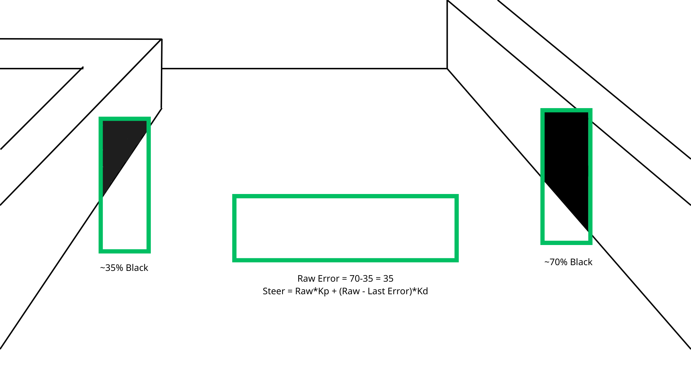
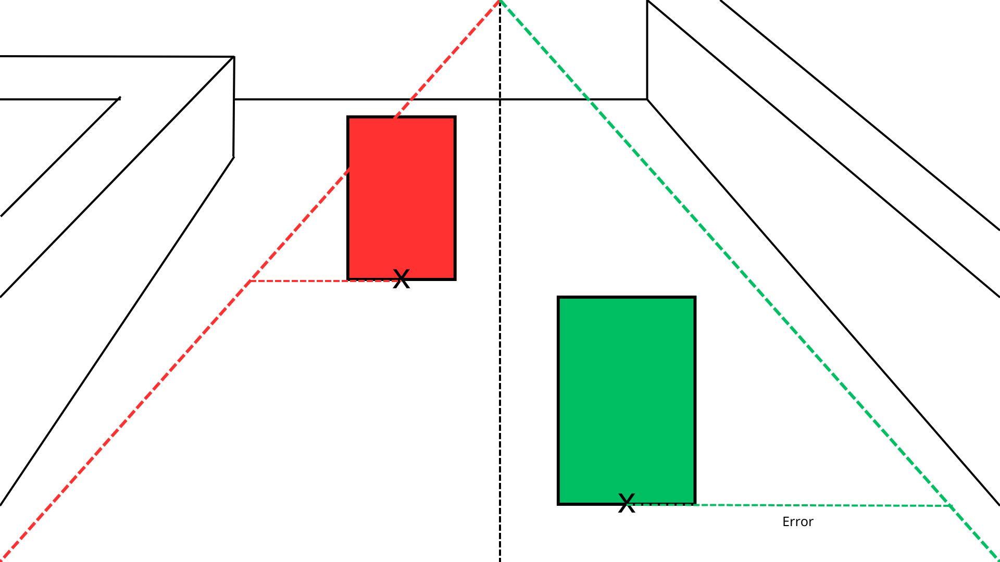
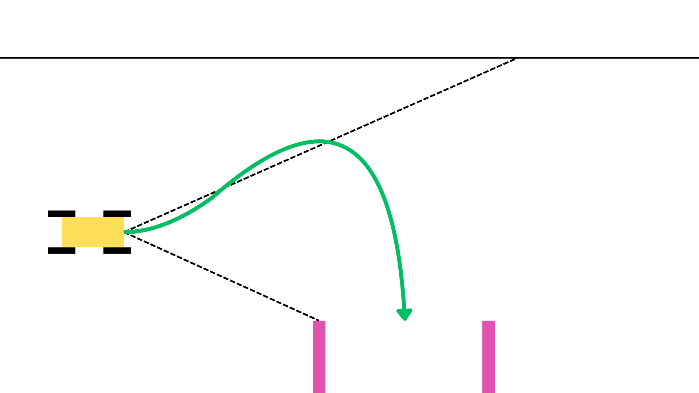

Open Challenge:
    
We draw two boxes on two sides. We set a threshold, and if a pixel has RGB value within the threshold, it will be counted as "black". In order for the robot at the middle of the path, the fill of the two boxes must be equal. Therefore, our algorithm compare the fill ratio of the two boxes and use PID turning for the steering.

We also have a box at the center of the frame. When a color between orange or blue touches this box, it will know when to start turning. If the box detects the blue line first, it can be inferred that the robot is running in the counterclockwise direction and vice versa. 

  

Obstacle Challenge:

Scenario 1: Traffic signs visible
The camera detects a region of high density of either red or green in the field. It will draw a rectangle box around the block. For the robot to avoid the sign in the desired direction, the boxes must align with the two lines. Therefore, by measuring the distance between the base of the rectangles and the lines, an error value can be calculated and used for PID steering. 

Scenario 2: Passed all traffic signs
When no color of red or green is visible, the robot will infer that it has passed all traffic signs.  Now, a box is drawn on the left side of the camera, and the robot will attempt to drive relatively close to the wall, filling the box with 70% black color. The difference between the black color fill of the box and the 70% threshold is used for PID turning. Another box is drawn in the middle, and when the blue line touches that block, it will know that it needs to start turning. By doing so, the robot will be given the maximum possible turning angle, and when it completes turning, the distance from it to the incoming sign will be far, allowing it to make a lot of changes in course before executing a  maneuver around the line

After the robot completes 3 laps, the robot will align with the same method used with the blocks. When the robot aligns with the wall of the parking lot, it will run until the magenta color reaches a particular x coordinate on the camera. After this, we program a sequence of actions for the robot to execute. The reason why we choose such a rudimentary method rather than using computer vision for parking is that the distance travelled by the robot during this short task is really short, so the error margin of using the encoder is acceptable. Furthermore, our skill in handling computer vision data is not thorough enough to program such a difficult task using values extrapolated from the camera.

