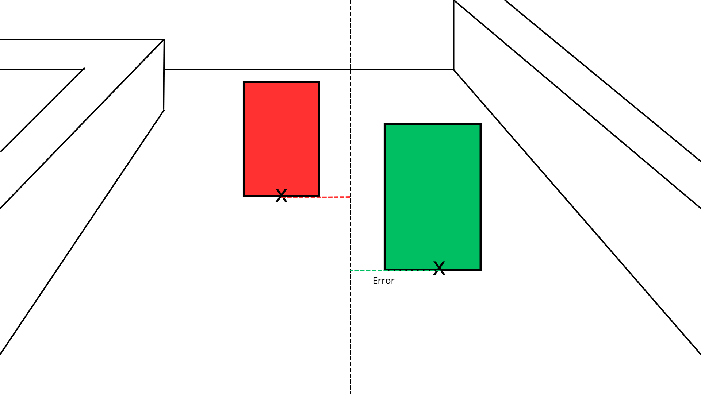
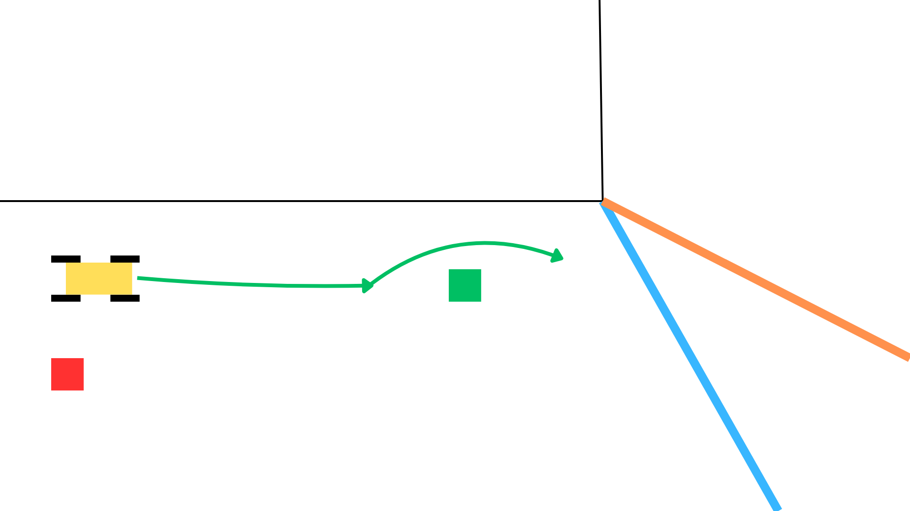

# Engineering Documentation - NSWRO Team
This is the GitHub repository of team NSWRO for the WRO 2025 Future Engineers Category


## Content
`Chassis, Motor and Processing Unit` This folder includes diagrams and images featuring the components of our robot.  
`Programming` This folder includes the programs and their corresponding illustrations.  
`Robot` This folder includes images of our robots from all views.  
`Team` These are the photos of our team!  

Our README consists of:
- [Our Team](#our-team)
- [Chassis, Motor and Processing Unit](#chassis-motor-and-processing-unit)
  - [Chassis Material](#chassis-material-choice-lego-and-pla)
  - [Processing Unit](#processing-unit-lego-education-spike-prime)
  - [Motors](#motors-technic-large-motor-l-and-xl)
  - [Differential Drivetrain](#differential-drivetrain)
  - [Ackermann Steering](#ackermann-steering)
  - [Camera](#camera-matrix-robotics-m-vision-cam-with-type-c-cable-pack)
- [Programming](#programming)
  - [Open challenge](#open-challenge)
  - [Obstable challenge](#obstacle-challenge)
- [Vehicle Images](#vehicle-images)
- [Videos](#video)
- [Future improvements](#future-improvements)

## Our Team


<h3>Overall:</h3>
   NSWRO is a team composed of three students from Nguyen Sieu High School who collaborate with Thay Phong Stem for the WRO 2025 season. We are the first team from Vietnam to compete in this category. Thus, there are many problems and difficulties, yet there are also many opportunities and experience we can gain from this event.

<h4>Cao Tung Lam (on the right)</h4>
    Lam is the most experienced team member. He has competed in WRO for three seasons. He has won acclaim by finishing 8th in the Junior Robomission category in 2024. This year, looking to enrich and diversify his experience in robotics, he chose Future Engineer to bolster his knowledge with new engineering concepts and new programming experience.

<h4>Do Cong Danh (on the left)</h4>
   This season is not Danh's first season, but it is his first season in such a high skill level environment. His contribution in this team is designing and assemblying the robot, assemblying the field. He also discovered many engineering principles which help our robot develop.

<h4>Nguyen Uyen Nhu (in the middle)</h4>
    Just like Do, this is Nhu's first season in WRO. However, her rich experience with programming and GitHub helped her build this impressive repository. Furthermore, he aided Lam in the programming process, making the programmes more efficient and the algorithms to be more accurate.    

Together, we function as a team that learns quickly from mistakes, shares ideas openly, and celebrates each small improvement. Every test run, every redesign, and every line of code is a step forward, and we are motivated by the chance to be the first team from Vietnam in this category.
    

## Chassis, Motor and Processing unit
Here is our hardware documentation.
We aimed for a chassis that stays planted, moves fast, and wastes zero space. The key goals were:

A low center of gravity to keep the robot stable during sharp turns and sudden accelerations.
A lightweight structure to make movement smoother and reduce strain on the motors.
A minimal size to improve maneuverability and reduce drag.
  
### Chassis material choice: LEGO and PLA

We start the development of our robot using LEGO because we have extensive experience with building and assembling LEGO models. Lam participated in WRO 2023 and WRO 2024 in the Junior Category, so he is very familiar with building robots with LEGO as the main material.

We 3D print several parts which does not exist in the current LEGO collection; they can accommodate LEGO just as good as authentic LEGO pieces, and the freedom of customisation helps us with reaching our main design principles with the chassis.
  
### Processing Unit: LEGO® Education SPIKE™ Prime
   
We choose LEGO processing units, Spike Prime or Mindstorm EV3, over Arduino or Raspberry Pi because our experience shows that we can execute complicated algorithms at an acceptable level.

Between EV3 and Spike Prime, we chose Spike Prime even though the central processing unit of the Spike Prime has a lower clock speed, as the Spike Hub's performance is still adequate for our algorithms. The Spike Prime Hub, including battery, is around 200 grams, almost half as light as the EV3 Hub; the total volume occupied by the Spike Prime Hub is around 0.158L, more than half as small as the EV3 Hub, which occupies 0.388L. These two characteristics of the Spike Hub make it superior to use compared to the EV3 Hub

<div style="display: flex; align-items: center;">
  <div>

|                 | Mindstorm EV3 | Spike Prime |
|-----------------|---------------|--------------|
| CPU Clock Speed (MHz) | 300 | 100 |
| Weight (g) | 385 | 200 |
| Volume Occupied (L) | 0.388 | 0.158 |

  </div>
  
</div>
  
### Motors: Technic™ Large Motor L and XL
   
With a LEGO chassis, we can opt for LEGO motors, which are way lighter than other pervasive, conventional robotics motors such as the GA25 370. Even though the torque figures and RPM are not as impressive, the benefit of having a manageable wiring system and light plastic case definitely outweighs this disadvantage.

For our powertrain, we use the Technic Powered up L motor instead of the Original Spike Motors because it's much higher RPM (315 vs 250) and its smaller size, and the breadth of the mounting hole on its case makes it extremely versatile in case of mounting position.

For our steering compartment, we utilize the Technic Powered up XL motor with a 3:1 gearbox to maximize torque. The stall torque of this motor is higher than the Spike Angular Motor (40Ncm vs 25Ncm). However, after completing our first version of the robot, we found out that such impressive torque figures are still not satisfactory for the turning compartment
<p align="center">
  
</p>
  
### Wheel Choice: 62.3mm technic for rear wheels and 49.5 spike for front wheels 
For the rear wheel, we need a wheel with great width and diameter for higher grip and better acceleration. Thereforem, we choose the technic 62.3mm tire for our rear wheels. Mean while, at the front, the wheels need to have small diameter so it has the most agility, so we choose the 49.5mm spike wheels.
<p align="center">
  
</p>
  
### Ultrasonic sensor
By determining whether there is a wall to the right hand side of the robot, it can determine which direction is its obstacle challenge going to be (Clockwise vs Counterclockwise)
<p align="center">
  
</p>

  
### Differential drivetrain

During cornering scenarios, the two rear wheels must rotate at different angular velocities to maintain the difference between the radius of the two circles accommodated by the inner wheel and outer wheel. Therefore, we implement a differential system.

<p align="center">
  
</p>
  
### Ackermann Steering

Ackermann steering is a geometric steering principle used in vehicles to ensure sefficient turning. It works by angling the front wheels so the left and right wheels follow different turning radius to each other, allowing all wheels to roll without slipping. The inner wheel turns more sharply than the outer wheel because it traces a smaller circle. This mechanism is critical to our robot because of the accuracy that it provides.

Upon steering, the inner side of the robot facing the center of the rotation aligns with a circle of a smaller radius, which has a tangent of a different angle compared to the outer circle. In order to achieve the maximum turning effect, the wheel need to steer at a different angle in order to accommodate the tangents, and we will use ackermann steering to achieve this.

<p align="center">
  
  
</p>
  
### Camera: Matrix Robotics M-Vision Cam with Type-C Cable Pack

We use Matrix Robotics's M-Vision Cam over other cameras because it has a processing unit inside the camera itself. Consequently, the LEGO Spike Prime Hub does not have to execute extra image processing algorithms, prolonging the battery life and maintaining a healthy load on the processing unit.

The camera has the STM32H7 Processor, clocking 480Mhz, allowing it to perform heavy load tasks of image processing. Its operating voltage is 5 Volts so it completely matches the output voltage of the LEGO Spike prime hub. By connecting the correct cables with the LEGO Spike prime hub, the camera can communicate with the hub via UART communication interface and LPF2 data protocol. 

<p align="center">
  
</p>

This camera supports LAB Color space, which is extremely accurate for the condition on the field compared to traditional HSV or RGB. 

In the diagram below, as you can see, the A axis runs from left to right, towards a red region. Meanwhile, the B axis runs toward yellow. Last, the L axis shows brightness, runs from dark to bright. The main reason why we choose this color space instead of RGB is because it seperates color from light. In the environment of the competition area, lightning might shift so the image may become darker or brighter unexpectedly. While this shift will cause a change in all three RGB Values, it only cause a shift in the L value of the LAB colorspace, the only parameter measuring brightness.

<p align="center">
  
</p>
  
### Transition from ver 1 to ver 2

Ver 1 design:  
<table>
  <tr>
    <td><br>Front view</td>
    <td><br>Left view</td>
    <td><br>Right view</td>
  </tr>
  <tr>
    <td><br>Back view</td>
    <td><br>Top view</td>
    <td><br>Bottom view</td>
  </tr>
</table>

Originally, for our robot design, we utilised an elevated camera, as well as a longer and bigger robot design. This allowed us to have a wider viewing angle surrounding the robot, allowing our navigation system to be more efficient. However, the camera required many reinforcements surrounding it to stabilize. Moreover, the bulkier build made the robot more unstable, leading to frequent drifts while moving. Overall, this made the design much less consistent than our expectation, and this is why we switched to a newer design.

Our new robot is overall shorter, and most of its mass is concentrated at a lower point. This lowers its centre of mass, thus making the robot more stable while steering, especially at tight angles. Next, the choice of placing the camera right in front of the camera instead of placing it at an elevated point allows for the viewing angle to still be at a viable position while removing all of the unnecessary scaffolding of the elevated camera. Besides this, we decided to 3D print the pieces for the Reverse-Ackermann Steering. We were able to remove unnecessary components of the original 3x3 Bent Perpendicular Pin Connector. This helped us shorten the length of the vehicle a bit more. Finally, by changing the back wheel from the Lego Spike wheels to a 62.4 mm Lego Wheel, we increased the friction of the driving wheel to the driving field. All of this helped make our robot more optimized, and improved our driving and navigation greatly.

  
## Programming
Here is our software documentation
### Open Challenge
   
We draw two boxes on two sides. We set a threshold, and if a pixel has RGB value within the threshold, it will be counted as "black". In order for the robot at the middle of the path, the fill of the two boxes must be equal. Therefore, our algorithm compare the fill ratio of the two boxes and use PID turning for the steering.

  ```
Add = 200 if Cam_val[0]>10 and Cam_val[1]>10 else 0
while GetColor() == 0:
    steering(0)
Drive.reset_angle(0)
while abs(Drive.angle()) < Add:
    steering(0)

if GetColor() == 1:
    ColorCondition = 1
    Plus = -30
else:
    ColorCondition = -1
    Plus = 40
print(ColorCondition)
for i in range (11):
    while GetColor() != ColorCondition:
        SteerCamOpen(ColorCondition, Plus)
    while GetColor() == ColorCondition:
        SteerCamOpen(ColorCondition, Plus)
Drive.reset_angle(0)
while abs(Drive.angle()) < 2000:
    SteerCamOpen(ColorCondition, Plus)
```

We also have a box at the center of the frame. When a color between orange or blue touches this box, it will know when to start turning. If the box detects the blue line first, it can be inferred that the robot is running in the counterclockwise direction and vice versa.

In addition to the main boxes, we include two small boxes at the bottom of the frame. These bottom boxes only turn black when the robot has moved into a position where the front boxes can no longer see the black line and the robot is very close to the wall. When both bottom boxes detect black, the robot enters a priority correction mode, where steering decisions rely on the bottom boxes instead of the main ones. This prevents the robot from hugging the wall or losing the track when the front sensors no longer provide reliable data.


There will be a default error which will be put into the program so that the robot will stick to the wall. For example, when the robot is close to the inside wall and the wall error is -30, which means the robot needs to turn right, a default error of 30 will be added to neutralise the error. Like this, the robot will follow the walls very tightly, minimizing lap time.

    


### Obstacle Challenge

## How we detect the blocks
We will create specific threseholds for the colors (Black, Red, Green and Magenta). When a pixels is registered to be within these thresholds, it will be counted. When a group of counted pixels are close to each other, a rectangle will be drawn around them and will be identified as a blob. We also have a threshold for the area of the rectangle so any small noises will be removed. Also, further down, we can use a function to measure the density of counted pixels in the blobs: b.density(). If the value from this function is too low, the blob will be ignored.
  
## Scenario 1: Traffic signs visible
The camera detects a region of high density of either red or green in the field. It will draw a rectangle box around the block. The robot will use PD algorithms adjust the robot so it encounters the block directly. By measuring the width of the image captured, the robot can estimate the distance between the robot and the block, and when the width is above 60 pixels, it means that the robot finds the block really close and will engage a fixed maneuver. However, in some scenarios, the robot may find the blocks too close to it, so if the block's width is above 90 pixels, the robot will backdown several centimeters before engaging the maneuver. 

<p align="center">
  
</p>
<p align="center">
  
</p>
  
## Scenario 2: Passed all traffic signs


When no color of red or green is visible, the robot will infer that it has passed all traffic signs.  Now, a box is drawn on the left side of the camera, and the robot will attempt to drive relatively close to the wall, filling the box with 70% black color. The difference between the black color fill of the box and the 70% threshold is used for PID turning. Another box is drawn in the middle, and when the blue line touches that block, it will know that it needs to start turning. By doing so, the robot will be given the maximum possible turning angle, and when it completes turning, the distance from it to the incoming sign will be far, allowing it to make a lot of changes in course before executing a  maneuver around the line. However, the magenta walls can distort the black color of the wall, so that the density of color black will decrease. To mitigate this effect, we also add the magenta pixels to the rectangles so it will also avoid the parking lot besides the wall.

<p align="center">
  
</p>

After the robot completes 3 laps, the robot will align with the same method used with the blocks. When the robot aligns with the wall of the parking lot, it will run until the magenta color reaches a particular x coordinate on the camera. After this, we program a sequence of actions for the robot to execute. The reason why we choose such a rudimentary method rather than using computer vision for parking is that the distance travelled by the robot during this short task is really short, so the error margin of using the encoder is acceptable. Furthermore, our skill in handling computer vision data is not thorough enough to program such a difficult task using values extrapolated from the camera.

<p align="center">
  
</p>
  
## Vehicle Images
<table>
  <tr>
    <td><br>Front view</td>
    <td><br>Left view</td>
    <td><br>Right view</td>
  </tr>
  <tr>
    <td><br>Back view</td>
    <td><br>Top view</td>
    <td><br>Bottom view</td>
  </tr>
</table>
  
## Video

### This is our video for the open challenge!  
[Click here!](https://youtu.be/54i8wre7FL8)

### This is our video for the obstacle challenge!
[Click here!](https://www.youtube.com/watch?v=SsX73BRtf50)

## Future Improvements

Even though our robot performs reliably, we are already thinking about how to make it better for future competitions.

### Chassis Refinement
We want to make the chassis even lighter without losing strength. Using smaller, more precise 3D printed parts can lower the center of mass and improve stability during sharp turns.

### Motor and Gear Optimization
We plan to experiment with different gear ratios and motor placements to increase torque and improve steering response. Testing these adjustments will help the robot handle tighter corners more confidently.

### Camera and Vision System
Upgrading the camera or adding more processing power could allow more advanced image analysis. This could help the robot detect obstacles faster, track lines more accurately, and adapt better to changes in lighting.

### Software and Algorithm Enhancements
We want to explore adaptive PID control that adjusts automatically depending on speed and track curvature. We also plan to improve obstacle detection using shape recognition and predictive algorithms to navigate complex sections more efficiently.

### Testing and Data Analysis
More rigorous testing and data collection will help us understand every small failure and success. By analyzing sensor logs, we can fine-tune every part of the robot for maximum performance.

### Team Workflow
We aim to make our workflow faster and more organized, using simulations to test new ideas before building them and keeping all programming changes well documented. This will allow us to iterate more quickly and reduce mistakes during preparation.

Every improvement we make is an opportunity to learn and push the robot further. We are excited to keep testing, learning, and building because each upgrade brings us closer to a more precise, stable, and faster robot.